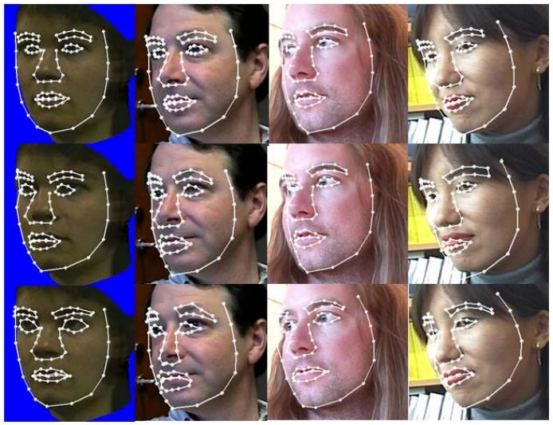
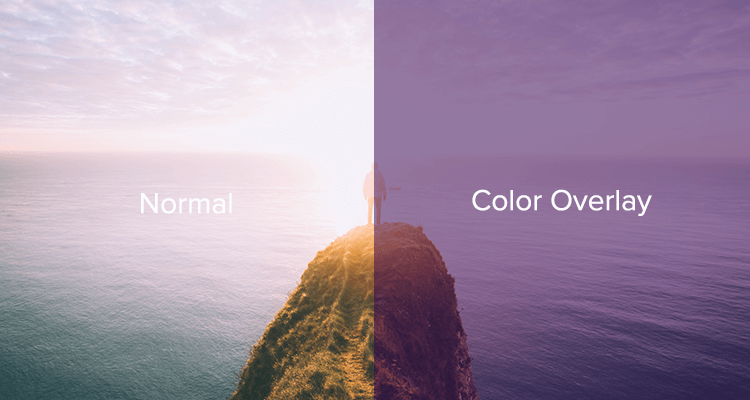
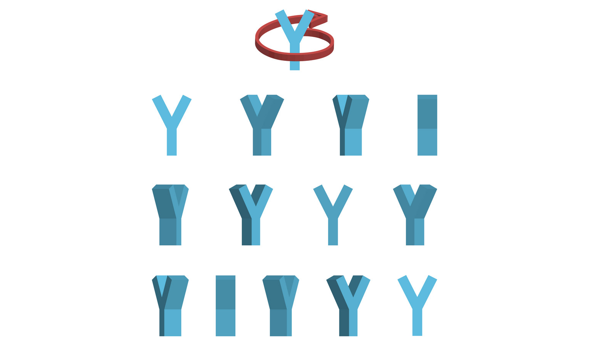
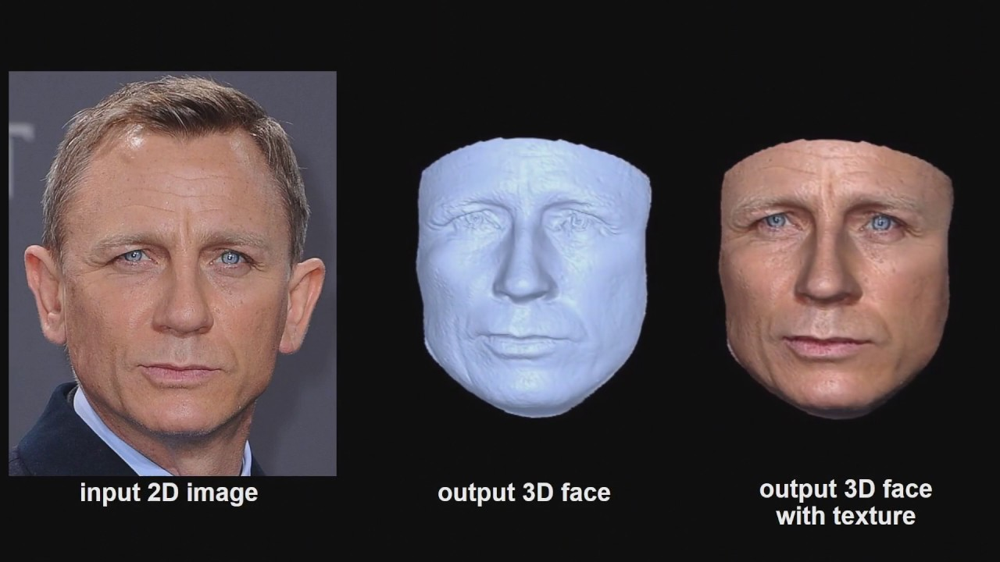

# FaceFilter
**Make funny face filter like snow and snapchat**

## Requirements

**Open-CV : Display real-time video and deal with various visual problems**  

 

.  

**Face Detection  : Find the face from picture**  

 

.  

**2D Face Alignment  : Find 2D annotations from the face for prepare**   

 

.  

**3D Face Alignment : Find 3D annotations form the face for practice**  

  

.  

**Overlay : Overlay face filters on the original image(video)**  

  

.  

**3D Image Rotation : Rotate face filters as direction of watch changes in 3D**   

.  

**Face Reconstruction : Reconstruct 3D face model for swiping two faces**  

